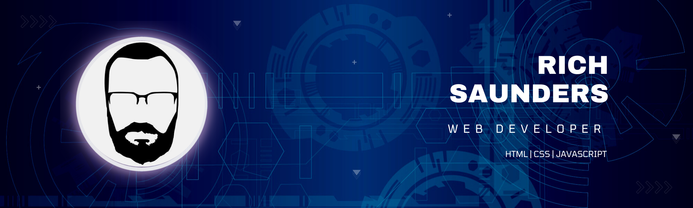
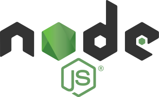

   

# Hello!

I suppose this is the part where I tell you a little bit about me?

   
## 🔧 I am a junior developer skilled in:
    
    

   
## 📚 I am currently learning:   
     
     
   
## 💻 Projects
1️⃣ I am currently working on my first project.
🐉 I am making a wiki type site for cryptids, creatures of myth, legend and folklore.   
🦄 I have always been a big fan of fantasy as well as myths, legends and folklore. I have always found it's hard to find a central catalogue or compendium for these. So, I decided to make one.   
🧛 I'm sure I will need some help filling it up and much like Wikipedia I'll be reaching out once I have everything in place.   
🧟 I hope that this will serve not only as a great knowledge base for those who have interest in cryptozoology but also serve as a great place of inspiration for creatives working on their own creatures and tales.   

## 📖 Other Skills
🖋️ I have a lot of experience in content writing, both on blogs and general webpages as well as full articles. I have always done so with an SEO focus and I have written blog posts for [Norfolk Developers](https://www.norfolkdevelopers.com/) & [Tech Educators](https://techeducators.co.uk/).   
🧑‍💼 I have a lot of experience as a people manager, managing small & focused teams of just three people as well as larger teams of 20+ people.   
🎓 I am a real philomath with a thirst for knowledge, I am also a keen teacher and mentor who has a real belief that all knowledge should be accesible to all.   
👨‍🏫 I am big believer of equal opportunities and I am a volunteer coach at [Codebar](https://codebar.io/coaches)    

## 🧠 A bit more about me
👩 Behind me is my fantastic partner who helps to motivate and drive me forwards.   
👧 I am the proud father of a wonderful daughter.   
🐶 I have two dogs that keep me on my toes.  
🎮 I'm a keen gamer!   
🎲 And let's not forget board games too!   

## 💬 Get in touch
📧 You can email me at richsaunders@protonmail.com   
🐦 Find me on Twitter at [@Crimson753](https://twitter.com/Crimson753)   
🤝 Or on [LinkedIn](https://www.linkedin.com/in/rich-saunders/)
